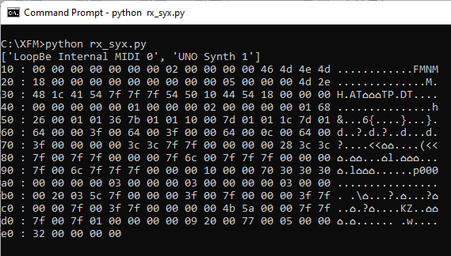
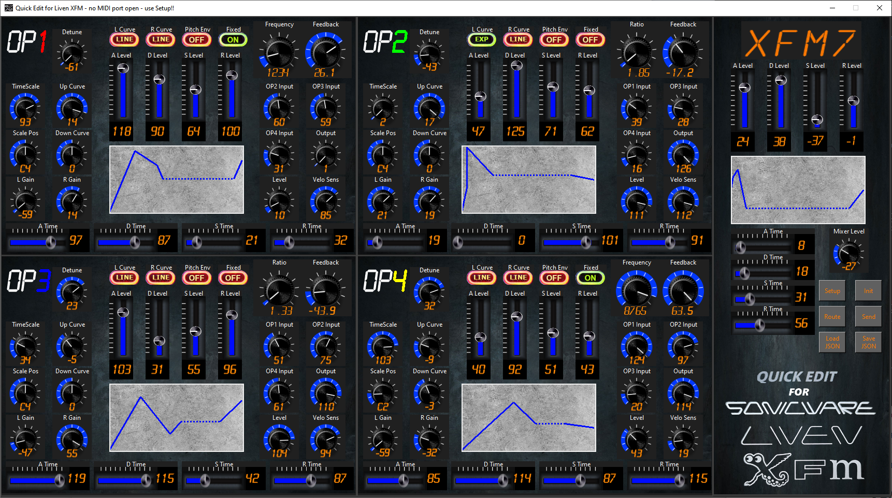

# XFM
## Sysex viewer/editor for Liven XFM

So this is intended to be a patch editor for XFM. As users will know the on-board editing in XFM, with the overlay, is quite a convoluted process because your only view of what is going on is through that four character 14-segment display so you can't "picture" the ADSR wave shapes or anything like that and you can only see the set value of **one** control at a time. As the buttons are over-loaded you also need to keep switching between page1/page2 to get the right function on some button.

The plan with this Python utility is to be able to see everything at once, as "visually" as possible and one knob per control. The aim is also that the interface to XFM itself be as seamless as possible. It's true that you will have to manually trigger a patch to be sent from XFM to the PC/editor to start working on something that already exists in XFM. But, once in the editor, as changes are made they should be automatically sent back (but read below about "autosend" in settings.json)

Note that this editor MUST have latest firmware in the XFM. At time of writing (in fact on the day it was released) this means V3.0.46 but in any case it won't work if you have an older V2 version so go to the download section on the Sonicware site:

[Sonicware Downloads](https://sonicware.jp/pages/downloads)

and get version 3.0.46 or later. To install it into your XFM follow Chris Dodsworth's video here:

[](https://youtu.be/bHxyV0qwFns)

A video linked below also shows how to check that you have V3.0 firmware.

### Download

While you can "git clone" this repository and "python xfm.py" to run the code (which is what you would do if you plan to work on this and edit the .py code - see notes towards the end of this README) it is much easier if you simply want to "use" the program to select "Releases" on the right of this screen, pick the latest issued release and download the .zip file for it. The release .zip has been created using package.bat (in this repo) which in turn uses pyinstaller which gathers together a copy of python, the code itself, all the support libs it uses and builds them into one .exe file: xfm.exe

Also in the .zip are some added support files:

**README.mhtml** This is a file you can load into your favourite browser (Chrome, Firefox, Edge, etc) that is a "one-file" version of *this* text you are reading right now - so it is basically the user manual. Ignore this at your peril!

**initpatch.json**: this is simply a copy of the TP01, default patch after I told XFM to "init" a patch being edited then extracted this from XFM. This is the first file the editor loads to ensure that all the controls start in the default state. It's also reloaded if you press "Init". If you wanted to set up a "template" so the editor always starts in the same place or returns to it when "Init" is pressed then either edit this file or just copy a JSON patch file you have extracted or worked on over the top of initpatch.json

**images_animations/\*.***: this is core to how the editor works - all the controls are just multi-frame PNG animation files and they are all stored in that images_animations/ sub-directory and are loaded at the very start when you first run the program. The pause as the program starts is because it's taking each of these and breaking each one into 100+ sub-images and storing them in a Python dictionary in memory. When you drag a control from value 37 to 56 or whatever all you are really doing is having it play animation frames 37 to 56. I created all the animations themselves using Knobman. I have half a mind to make a video explaining how the program works and how I wrote/engineered it and that will include details of [Knobman](https://www.g200kg.com/jp/software/knobman.html). In theory this would allow anyone feeling "artistic" to create a new "skin" for the editor - giving it your own look and feel

**stipple/\*.***: In the routing window the lines connecting the operators and OUTPUT are drawn in different densities to try and indicate how strong the signal path is. The density varies by using stipples (dot patterns of varying coverage). The files in this directory are the stipples used (and the images/program used to generate them)

**factory/\*.***: This is an entire collection of all the factory presets in XFM as .json files that can be loaded into the editor and sent to XFM. Use this to put back any patches you inadvertently stomp on. If you want to know the exact order of all the patches in all the banks see the files in [Preset files](https://github.com/wrightflyer/XFM/tree/master/XFM_preset_info) and, in particular:

[List of Presets](https://github.com/wrightflyer/XFM/blob/master/XFM_preset_info/presets.csv)

Any unused slots in a bank of 16 not listed there and all of banks BK30, BK31 and BK32 are simply padded out with up to sixteen TP01 .. TP16 patches. Note that in that chart the suffix "(dup)" means "duplicate". Almost all the patches in the first XFM1 and XFM2 banks (for example) are actually duplicates of patches found in other banks. For example "EP.1" (electric piano 1) appears half way through bank XFM1 but is also found as the first patch in the KEY1 bank too.

**settings.json**: I mention this in the video linked below, it's a very simple 4 entry file. You can use Notepad or some other simple text editor to set most options "true" or "false":

*saveJSON*: The first option will pre-tick the "save JSON" option on the Setup screen if this is "true". This means that each time a patch arrives from XFM it is saved as PATCH_\<name>.json. You can use this to save factory presets easily before you accidentally/deliberately destroy them! ;-)

*showOutlines*: This will add white bounding rectangles to make the position of the controls/labels more obvious. It has this effect...


*verbose*: The third option allows you to add verbosity so that as things happen info will be output to the launch console if started from a Command Prompt. 

*autosend*: The fourth is quite important so warrants an entire section in this guide...

### Automatically updating XFM

The fourth entry in settings.json is "autosend". Unless I change my mind after writing this the value you will find there will be 0. That means that by default the auto-send feature is switched off. What auto-send can do for you is to repeatedly transmit the patch data back to XFM so that, as you make adjustments to the editor, the values are then sent back to XFM.

Now you wouldn't want this to happen for every minute adjustment. Suppose you dragged a slider or rotated a control from 0 to 127. If the editor sent changed data for every small change then as it passed through 1, 2, 3, 4, ... 125, 126, 127 it would send an update - so 127 updates just for the change of one control.

So I have written things so that controls "remember" if they have been adjusted. Then the auto-send is a *scan* that is made regularly to go round all the controls and ask "have you changed recently?". Once the scan is complete they are all told to erase their memory to wait for the next scan - if something is changed in the meantime they will remember. If, during the scan, even one control says "yes I have changed recently" then the editor sends the updated patch to XFM.

The "autosend" variable in settings.json tells the editor how often it should perform the scan and is expressed in milliseconds (1/1000ths of a second). So if you set the value to 3000 it will perform the scan every 3 seconds and so on. In use I've found 3000 to be a fairly comfortable number to use. Obviously if you want XFM to respond to your edits quicker you could set it to a lower number but say you went all-in and set it to 1 then that means the scan would happen 1,000 times per second and we'd be back to that scenario when dragging a control from 0..127 might be caught 39 times between one end of the movement and the next - so updates would be sent to XFM 39 times just for one small movement. I hope you can see that you don't want that. On the other hand suppose you set it to 60000 where 60000ms is 60s which is a whole minute. If you did that then you could fiddle with controls in the editor but would then have to wait up to a whole minute before they became evident in XFM. So you need to pick a happy balance between responsiveness and silly transmission rates. Like I say I've found 3000 to be a pretty reasonable value. If I was to change I think I'd head in the even slower direction, like maybe 5000 rather than going for anything faster.

By default auto-send is 0. That is a special value meaning "never scan/send". In this case to send patches you have to resort to the **Send** button and just do updates as and when you are ready

### How to use the editor

Maybe start by taking a look at these this YouTube videos I made. Make sure Closed Caption Subtitles are turned on because, after I posted the video, I added some corrections and additional information in the subtitles. (Youtube doesn't let you update the video itself once published - but you can post-edit the sub-titles)

[](https://youtu.be/xW3tTtv1Zck)

A second, (earlier!), video is a desktop capture (on a particularly big monitor) to try and explain the operation of the editor but just using files loaded/saved on disk (no MIDI connection to XFM). Some of this is covered in that first video but if nothing else this video demonstrates why the world should all own Samsung 3440x1440 monitors!!:

[](https://youtu.be/i-gdSHQqYMY)

When you run the editor the main screen with all the controls appears. During the loading process the program does a JSON load of the file called initpatch.json from disk and loads all the values it contains into each and every one of the controls. This even includes setting the four character name at the top right to be "TP01" which is what XFM  uses it if you ask it to "Init" a patch. The basic patch has very little set apart from OP1 output level set to 127 so it consists of nothing but OP1 playing to the output using the default sine wave at a x1.0 ratio.

### Set MIDI ports

The first thing you will need to do is connect two MIDI cables to XFM. One plugged into its MIDI In and one into its MIDI Out. In the editor you need to find the set of buttons at the right hand side and press the one marked "Setup". 


Then in the two panels at the left where you will hopefully see the ports out to XFM and back in listed pick one in each box and click the "Open MIDI IN port" / "Open MIDI OUT port" buttons beneath each box. If you are only going to use the editor to view patches (and perhaps only have a single cable from XFM MIDI Out to the PC) then you only need to worry about setting the IN port and can ignore OUT. But if you plan to send edited patches back you will need two cables and to have opened ports in both directions.

On the XFM, to send a patch it's best to put the editing overlay on top of XFM. You aren't necessarily going to edit on XFM but it reveals all important functions like MIDI export. Before you place the overlay press Function-Edit and then select the bank (octave up/down buttons), followed by the patch you would like to work on (which could be one of the unused user patches) - use the value knob or the 16 step keys to pick the right patch within a bank. When you have got to a slot you want to work on then press OK and the display will briefly show "EDIT" to show you are now in edit mode for that patch.

Once you are into EDIT mode on XFM you can then press the button marked "MIDI EXPORT" on the overlay and then the "OK" button. Assuming the right cable is in place and connected to the right port the name of the patch you started to edit and then chose to export on XFM should appear in the four characters at top right of the editor. You are now in business and ready to edit.

The editor is basically a whole load of knobs/sliders of which many have very simple 0..127 setting range. The program is mouse operated so for the majority of the controls if you click on one and drag up/down or left/right it will increase/decrease the value shown. For more accurate control you can also adjust by clicking left/right mouse buttons where left click increases the control by one step and right click decreases it by one. The program also supports mouse wheel operation. So you can rotate mouse wheel up/down while hovering over a control to increase/decrease the control.


There are three knobs (only two visible at any time) that behave a little different from all the others. These are the Ratio/Frequency and Feedback knobs at the upper right of each panel. For Frequency mouse drag up/down adjusts the upper 2 digits (hundreds/thousands) and mouse drag left/right adjusts the lower two digits. For Ratio and Feedback up/down adjusts the integer part and left/right adjusts the decimal fractional part.


The controls can be (and are more easily) adjusted my mouse-wheel movements too. The vertical scroll wheel will adjust the upper two digits (Frequency) or non-fractional part (Ratio / Feedback). 


A horizontal scroll wheel (justification for getting something like a Logitech MX Master mouse!) will adjust the lower two digits (Frequency) or the fractional part (Ratio / Feedback).


If using a mouse that only has a single scroll wheel then horizontal scroll wheel can be "simulated" by moving the vertical scroll wheel with Shift key on the keyboard held down.

After you have modified the patch in the editor in some way(s) then in the collection of buttons at the right select "Send" and that will send the modified patch back to XFM. You can tell this has happened (apart from the fact that the sound should change when you play it!) by the fact that the four character name should briefly appear on the XFM screen just as yoiu send it.

### Issue reporting

Note that if you have any issues or feature requests or you just need help  you can use this to log them:

https://github.com/wrightflyer/XFM/issues

but that does require you to have a github.com ID to be able to post. So failing that try the Sonicware groups on either [Facebook](https://www.facebook.com/groups/sonicwareliven/) or [Reddit](https://www.reddit.com/r/sonicware/) which I always monitor anyway.

## JSON files

In order to be able to save something you are working on, so you can some back to it later or perhaps because you have a patch that is *so good* you want to share it with others that have a copy of this editor the program allows you to save (and load) its current state as JSON files. There are buttons for "Save JSON" and "Load JSON" in the group of buttons to the right. 


If you work on a patch then click/drag the four characters at the top right of the editor to set a name. 


All the usual mouse controls work when adjusting these so you can drag up/down (or left/right if you prefer), You can use either mouse wheel and you can use left mouse clicks to increase characters one by one between 0..9, space, A..Z.

**NOTE:** Just for these four controls the right mouse button does NOT step backwards between the characters. In fact it's the way you can add a dot after any of the characters. Right click toggles the dot on/off. Because right click does not have the usual function of stepping down by one as in other controls if you need to go "backwards" in the character sequence use drag/wheel movements then if you "over shoot" use left-click to advance back to where you want to be. Sorry about this but I couldn't think of anything better than right-click to switch dots on/off! ;-)

Once you have set the four characters (+ any dots) then click "Save JSON". You don't get a file dialog or anything like that for this - the program will simply save its current edit controls state, in the current directory, as PATCH_\<four characters + dots>.JSON. So if you have set the patch name to "CJL1" it will save PATCH_CJL1.json to disk (and over-write anything already there that has that name - be careful!).

For those that don't know, JSON looks like this:

```
D:\XFM>type PATCH_CJL1.json
{
    "Name": "CJL1",
    "Pitch": {
        "ALevel": -21,
        "ATime": 37,
        "DLevel": 26,
        "DTime": 55,
        "SLevel": -31,
        "STime": 52,
        "RLevel": -2,
        "RTime": 45
    },
    "OP1": {
        "Feedback": -210,
        "OP2In": 38,
        "OP3In": 14,
        "OP4In": 85,
        "Output": 127,
        "PitchEnv": 0,
        "Fixed": 0,
        "Ratio": 819,
        "Freq": 4400,
        "Detune": 0,
        "Level": 63,
        "VelSens": 0,
        "Time": 0,
        "UpCurve": 0,
        "DnCurve": 0,
        "Scale": 3,
        "ALevel": 61,
        "ATime": 45,
        "DLevel": 65,
        "DTime": 49,
        "SLevel": 32,
        "STime": 0,
        "RLevel": 0,
        "RTime": 63,
        "LGain": 0,
        "RGain": 0,
        "LCurve": 0,
        "RCurve": 0
    },  
    etc
```

As you can see this is human-readable (and editable!) text so you can load any .json file into a text editor to look at it (even modify it). In fact you might have already done some JSON editing with settings.json to setup the program as you want.

The controls in the program won't allow themselves to be set to any value out of range (to ensure the program doesn't ask to draw an animation frame that does not exist), so if you set a parameter that usually has a -18 .. +18 setting range to 12345 (say) then nothing will happen. The control will not change as it rejects the out of range 12345. Because it's normally the program itself that writes the JSON files it already polices the controls so they can't go out of bounds so the JSON files it writes are bound to contain sensible values - but you could edit in mad values and they will be treated with the scorn they deserve.

If you are tempted to edit the files before load, then most things here have either a -64..+63 or 0..127 range (though some are -63..+63 and there's even -18..+18 and the Scale Pos that displays as C1..C7 is actually 0..6 in the file) but note the three "big" controls: Ratio, Feedback and Frequency. They have a slightly different encoding. Feedback is actually held as N * 10 in the file. So if the value is -18.2 it's actually held in the file as 10 times that (so no decimal) as -182. Similarly 76 in the file would be 7.6 displayed. Rather curiously, even though the UI only allows Frequency to be set to integers in the range 1Hz to 9755Hz the value in the file is also * 10. So 440Hz (international A) appears in the file as 4400. 9755 would actually be 97550. So the bottom line for Frequency is "add another 0". Ratio is different - what is stored in the file is * 100 the actual value so an actual setting of 8.19 is held in the file as 819

All JSON load actually does is take a two part section name like "OP2""Atime" and put whatever number is in the file into the control that internally has that name. From the source code you can see the names it uses internally:
```
# following is list of all animated controls - a key name, a label, an anim to use and X/Y
controls = {
    "Name:chr0" :    [ "",          "chars",   1430, 10 ],
    "Name:chr1" :    [ "",          "chars",   1430 + 64 - 8, 10 ],
    "Name:chr2" :    [ "",          "chars",   1430 + ((64 - 8) * 2), 10 ],
    "Name:chr3":     [ "",          "chars",   1430 + ((64 - 8) * 3), 10 ],

    "OP1:Feedback" : [ "Feedback",  "blk128",    COL_FEEDBACK - 12, 10, -63 ],
    "OP1:OP2In" :    [ "OP2 Input", "0to127",    COL_RATIO, 130 ],
    "OP1:OP3In" :    [ "OP3 Input", "0to127",    COL_FEEDBACK, 130 ],
    "OP1:OP4In" :    [ "OP4 Input", "0to127",    COL_RATIO, 220 ],
    "OP1:Output" :   [ "Output",    "0to127",    COL_FEEDBACK, 220 ],
    "OP1:PitchEnv" : [ "Pitch Env",  "on_off",   SWITCH_X + (2 * SWITCH_OFFX), SWITCH_Y ],
    "OP1:Fixed" :    [ "Fixed",     "on_off",    SWITCH_X + (3 * SWITCH_OFFX), SWITCH_Y ],
    # two controls - one location - what's displayed depends on Fixed On/Off
    "OP1:Ratio" :    [ "Ratio",     "blk33",     COL_RATIO - 12, 10 ],#not 0to127 !
    "OP1:Freq" :     [ "Frequency", "blk98",     COL_RATIO - 12, 10 ],#not 0to127 !
    "OP1:Detune" :   [ "Detune",    "_63to63",   COL_DETUNE, 25, -63 ],
    "OP1:Level" :    [ "Level",     "0to127",    COL_RATIO, 310 ],
    "OP1:VelSens" :  [ "Velo Sens", "0to127",    COL_FEEDBACK, 310 ],
    "OP1:Time" :     [ "TimeScale", "0to127",    COL_TIMESCALE, 130 ],
    "OP1:UpCurve" :  [ "Up Curve",  "_18to18",   COL_DETUNE, 130, -18 ],
    etc.

```
and those are the exact same names that are used in the JSON file (well part from "Name" which has special handling)

At the bottom left of the Setup screen is a tick box (which is also influenced by the "saveJSON" entry in the settings.json file) that says whether the editor should save JSON patch files automatically on receipt from XFM. 


So if this item is ticked and then you transmit the patch called "WGGL" from XFM then as the editor receives it, it will automatically write it to PATCH_WGGL.json on disk. My thinking behind this option was that if you wanted to automatically archive the patches in XFM you could ensure this option was ticked then just go through all the patches in XFM, one by one, and transmit them to the PC. You'd then find your disk stuffed with PATCH_WGGL.json, PATCH_ORG.1.json, PATCH_F.TRP.json, PATCH_PSYC.json and so on - then store them away somewhere safe so you can now go on to use the editor to wreck them all! ;-) In the ZIP file look at the "factory" directory and you will hopefully find copies of all the factory patches for XFM already extracted in this way. So even when not connected to XFM you can load in factory patches and have a nose around to see what their control settings and route window look like. Talking of route window...

## The Route window

If you press the "Route" button (it's actually a "lift" button that will open it or bring it to the foreground if it's hidden under something else):


then a window like this will appear either on top or (if you have the luxury of a proper wide monitor) alongside the main editor:


That's a lot to take in at first sight but this is trying to give you an "overview picture" of how the four operators that make up the patch are interacting with each other and, ultimately, the "output". So there's a colour-coded box for each operator and I subtly coloured the OP labels in the main editing screen to match - they are also in the same ordinal position as the main editor layout.

Notice the text along the bottom. If you just want the routes without the complexity of the value simply click the mouse anywhere in the window (it toggles between the two states). The simplified view is then:


In this simplified form only the absolute key detail (ratio or Frequency) is actually shown but notice the lines that run either between any two operators or those lines that "loopback" on themselves that go back into the same operator. The loopbacks are "Feedback". You probably know this but around 0 (no feedback) the shape of wave output by the operator is **Sine**. If the value is strongly positive (and in the editor I arbitrarily picked 32.0 for this) then the wave changes to **Square**. If it is strongly negative (again this is -32.0 as far as the editor is concerned) then it is **Sawtooth** and if it's in the last range of positive values from +63.0 to +64.0 then it is **Noise**. The routing diagram (with detail) has a small wave graphic to show which of these each of the four operators is set to. It's just an icon though - it does not try to show the actually wave which morphs square-sine-saw-noise as the control is adjusted - maybe one day.

Also in the simplified diagram are lines between each operator. These are drawn with stipples so can be of varying "density" to try and reflect how strong that signal is. So if something is set to 10 (in a 0..127) range it will be very feint dots that are almost invisible to reflect that this path is not very strong. But if it is set all the way up at 127 then the line is almost totally solid to show it is a very strong signal (the default "TP01" patch basically just has one 127/strong path from OP1 to OUTPUT and nothing else)

When the route diagram is in detailed mode then the source point of every line is annotated with its actual set value. In fact one way to know which direction a line is pointing (apart from the fact that they are supposed to have "arrow heads" - but it's subtle!) is that the *start* of each line is where it's value is shown.

I like this routing diagram approach (more than all the editor controls in fact) because it is a very immediate way to answer the question "what's going on in this patch?". It's also a creative tool as you can maybe see "OP3 is not being sent anywhere - what if I set it's feedback to 64 (noise) and then route it at strength 20 (subtle) into OP1 and 2?"

### ADSR controls (question for the audience!)

As you probably know from using XFM already it has "odd" ADSR curves (quite "DX7 like" in fact) in that there aren't just 4 adjustments for ADSR but each point has a level and a time adjustment. I have tried to visualize this but I am ready to admit that I may have misinterpreted things and there's a better way to visualize them but I'll just describe what I am showing and someone can tell me where this is wrong...

So the level and the time controls all have 0..127 ranges. Now the window where I show these in the program are 256 pixels wide and 128 pixels high (guess why I chose these dimensions!!) so for the vertical (level) position I simply take 0..127 and plot it "as is".

For the horizontal position I imagine the 256 pixels broken into four areas that are each 64 pixels wide. So when a control is set to time=127 I start by halving it (63) then it's basically at the right edge of its 64 wide area and any lower value is to the left on that. But this does mean that if not all controls are wound up to 127 for "time" then there's going to be some "spare space" in that segment of the display. So what I actually do is work out how many pixels I am not using in each segment (so if Atime was 87 then there'd be 128-87 = 41 pixels not being used in A (20 after /2 because it's just 64 wide). Then add them all into the "sustain" part of the graph so it kind of "mops up the slack". It's why I draw that line dashed rather than solid. I don't know if this is actually a true representation or should it really only use Atime + Dtime + Stime + Rtime pixels across the graph and stop before the right hand edge? - I just thought it looked "messy" but perhaps it's actually the right thing to do?

In fact I wonder if it helps to show this bit of the code...
```
    def update(self, at, al, dt, dl, st, sl, rt, rl):
        # horizontally 128+128+128+128 is 512 but the window is only 256 wide
        # so start by halving all the horizontal values (but just for display)
        at = at / 2
        dt = dt / 2
        st = st / 2
        rt = rt / 2
        self.canvas.delete("adsrline")
        ax = at
        ay = 128 - al

        dx = dt + ax
        dy = 128 - dl

        sx = st + dx
        sy = 128 - sl

        rx = rt + sx
        ry = 128 - rl

        padding = 256 - (at + dt + st + rt)

        ystart = 128 # as Y coordinates start at top left this is bottom left pixel
        if self.key == "Pitch:":
            # pitch curve is -48..+48 bi-polar so start at mid height
            ystart = 64
        self.canvas.create_line(0, ystart, ax, ay, width=3, fill='#000CFF', tag="adsrline")
        self.canvas.create_line(ax, ay, dx, dy, width=3, fill='#000CFF', tag="adsrline")
        self.canvas.create_line(dx, dy, sx, sy, width=3, fill='#000CFF', tag="adsrline")
        self.canvas.create_line(sx, sy, sx + padding, sy, width=3, dash=(3,1), fill='#000CFF', tag="adsrline")
        self.canvas.create_line(sx + padding, sy, 256, ry, width=3, fill='#000CFF', tag="adsrline")
```
If anyone has a "better" way to approach that I am all ears!

## History of the development

This is a description of how this editor grew out of a simple idea to be able to create a PC program that could communicate with XFM and make it easier to go about editing patches for the 4 operator FM synthesizer. When I started I didn't even know what language I wanted to use. I use C++ and Python professionally in my day job. Over the last few years Python has become my favourite language and I like the fact that it is multi-platform so, with a following wind, this code that I developed in a Windows environment should be able to run in Linux - though I need to find out the status of things like the MIDI libraries in Linux. I'd like to say it would work in Mac too but I have no way to test that so perhaps someone else can?

### Graphics

The first thing I did was a simple Python program, adsr.py, (I like the simplicity of Tkinter for graphics) to run some experiments in drawing 8 point ADSR envelopes...


This was just playing about to understand how to visually represent 8 parameter envelopes as used by XFM. The work I did here would later become one of the classes used in the main program (with slightly fancier looking graphics)

### MIDI in Python

I also did experiments to read Sysex from XFM (rx_syx.py). I spent some time researching how you could interface to MIDI from inside a Python program. The library I ended up with is "MIDO" but this is really just a high level interface that then relies on a lower level, back end to connect to "ports" and in this case that is RT_MIDI. With mido you can just mido.get_input_names() to find the MIDI ports available and mido.open() one and register callback=function and then that function is called with a message each time something arrives on the port. I wrote some code to then hex/ASCII dump the 230+ bytes of the main patch message



At the start I had no idea what any of the bytes of this data controlled. It's not documented anywhere and Sonicware were too busy working on things like LoFi12 and SmplTrek to take time out to produce a document. So a lot (an awful lot!!) of the work in this project was capturing 100's if not 1000's of Sysex dumps like this picture. Each time I would make some small control adjustment and see what bit/bytes changed. The complexity of the layout of the data is simply incredible. I sort of assumed it would be a C struct and one localized element might change for a control adjustment but for some things the bytes are split all over the place. This is especially true for controls that don't have a simple 7bit (MIDI sized!) value holding 0..127. For things like Frequency/Ratio/Feedback you will not believe how complex the storage of the values is !! But to get a flavour...
```
    if offset == 0:
        freq = ((bytes[offset + 0x4D] * 65536) + (bytes[offset + 0x4C] * 256) + bytes[offset + 0x4B])
        if bytes[offset + 0x49] & 0x20:
            freq = freq + 128
        if bytes[offset + 0x49] & 0x10:
            freq = freq + 32768
    else:
        freq = ((bytes[offset + 0x4D] * 65536) + (bytes[offset + 0x4B] * 256) + bytes[offset + 0x4A])
        if bytes[offset + 0x44] & 0x02:
            freq = freq + 128
        if bytes[offset + 0x44] & 0x01:
            freq = freq + 32768
    print("op1 freq = ", freq)
```

However in discussion with Sonicware I later found out the reason for this and it all stems from the fact that MIDI data is 7bit. So if they have a block of patch variables that contain 8/16/24bit values this cannot be sent "as is" within a Sysex. So the main payload is actually put through an 8 bit to 7 bit conversion where the data is broken into blocks of 7 bytes and each is output preceded by a mask byte (also 7 bits) in which  it indicates which, if any of the subsequent 7 need to have an 8th bit (ie + 128) added. Once I understood this the payload made much more sense and while the original decode had me combining + 128's and + 32768's from all over the place - the new decode was much cleaner and the parameters were grouped in sensible ways.

### Graphics / Animations

I love playing with knobs!

I also wanted to prototype the "look" of the program before I had any way to draw animated knobs in Python. So I reverted to my old friend Ctrlr which is a GUI program for making MIDI control panels. 

[Ctrlr](https://ctrlr.org)

[Ctrlr on Github](https://github.com/RomanKubiak/ctrlr)

I was just interested in laying out controls more than anything. Now with Ctrlr it has a default "look and feel" as seen in this control panel I actually used for my own design Teensy4 based synth:


But I wanted to use my own knob design. Reading around I found that some users of Ctrlr used a dedicated knob design program called Knobman because Ctrlr can have an animation file attached to a control that is then used to draw each step of the control:

[Knobman](https://www.g200kg.com/jp/software/knobman.html)

There's Windows specific versions, Java versions and even an online based editor - I ended up using all 3 because each had specific things only they could do (like my "LCD like" font could only be used in Windows!). As well as the tools there is a gallery of knob designs from other people:

[Knobman Gallery](https://www.g200kg.com/en/webknobman/gallery.php)

It's slow to load but worth the wait as there's tons of knob designs there to choose from (or you can draw from scratch if you want). I ended up with a bit of both. Now I actually like the look of a knob like:


It had a "3D" look but I didn't like the red/white scale or the red pointer. I also noticed when I was editing on the XFM with the editing overlay in place that because the holes for the knobs were a bit bigger then the knobs themselves a "blue halo" would show through so I used knobman to create my own knob design that has subtle "ticks" in white to show scale but then a blue halo that grows as the knob is turned.

Another requirement I had (apart from the blue halo) was a way to instantly read the value of every control. So I searched and searched and found a Truetype LCD font

[LCD_Mono Truetype font - like XFM display](https://www.dafont.com/lcd-lcd-mono.font)

that was very like the characters in the XFM display. So I overlaid this on the rotary controls so they would show the value of the reading. In the end the editing looked like:


Knobman basically takes all the design elements of the knob (some of which vary from frame to frame - like the angle of the white mark, the blue halo and the LCD printed value) and then it creates either animated GIFs or animated PNG files with every frame in it. I already knew about animated GIF but didn't know about animated PNG. In the latter it basically draws each frame either side-by-side or on top of one another in a very wide or very tall image. The nice thing about that is that if you want to do your own animator it's just a case in a file that is w x N*h to cut out the rectangle from (0, h * N1) to (w, h * N2) and drawing that. As many of the controls have a 0..127 range they are effectively 128 small rectangles on top of one another. The code directory is full of such PNG animations like:


(that is just -18 to +18 so 37 steps but many are 128 small pictures!)

So anyway, having created PNG animations it was possible to initially prototype the look of the layout (complete with operational / animated knobs) in Ctrlr so it looked like:


(the one thing I could not fake "inside" controller were my dynamic ADSR curves so in this they are just static images as "placeholders").

Having seen how this would look in Ctrlr I then set about presenting an almost identical look and feel from actual Python code which basically involved writing an animation engine to be able to display one of many (often 128) small images in one location pulled out of an animated PNG file and to then add mouse support so that mouse events would be reported back into the "control" and allow its value to be adjusted. The UI of the program would then involve laying out about 100+ such controls and having code to load values into the controls when a MIDI Sysex patch arrives or to read the values back out if they were to be sent out by MIDI.

As I wanted to be able to save/restore edited patches to disk I actually hold the values of every control in an associated array (dictionary) and once you have it in that it's trivial to save/load to JSON.

### The final Python program

So all the foregoing were just prototyping experiments (it's a good way to approach software design in fact). So I had python code that proved I could draw dynamically changeable ADSR curves. I had code that could do MIDI interactions with XFM. I spent 10's and 10's of hours doing reverse engineering on the patch format (oh and something I bet no one else knows - if you change a patch name to include a "." (1..4 of them) then the patch dump gets 5 bytes longer and the location of about half the things in it change (sadly not everything!). So I actually had to do the reverse engineer of everything TWICE - once for 4 character names and one for 4 character + dot names!). I had designed all the animated graphics and I wrote a Python program using nothing but Tkinter to be able to draw any given animation frame. I then added "mouse awareness" to that so that the animations were "hot" and you could adjust them by dragging the mouse over them.

So finally it came time to put all these experiments together in one big program and I ended up with this...



Having watched one of Chris ("Lody") Dodsworth's excellent Sonicware videos I was inspired by a sketch he drew trying to explain XFM signal routing...


to implement a feature so that when "Route" is pressed on the main editor this secondary window will be toggled on. It shows the signal routing between each operator (density of line indicates strength of signal). Signal shape is shown - when feedback is close to 0 it is "sine", when large positive (but not 63..64) it is sawtooth, when positive 63..64 it is noise, when large negative it is square...


### Running / Using the code as a developer

So it's a Python program which means that to be able to run it using a git clone of this repository you need to have Python installed. It does not work with the now dead Python 2.7. It has to be some flavour of 3.x (a later one!)

Because I tried to stick with lib code that comes with Python (like Tkinter for the GUI graphics) there's not much else you need to install to run it. The main thing is going to be the libs for MIDI support. So you probably need:

    pip install mido
    pip install python-rtmidi

The latter is the lower level support (RTmidi) that allows Mido to open and interact with the MIDI ports on the machine.

If it's not installed already you will also need

    pip install pillow

While writing these words I also found that I used a feature in PIL (Pillow - part of Python's image handling) that is only available in a fairly recent Pillow (> v9.x) and that such a late version of PIL is only compatible with later versions of Python (3.9, 3.10, 3.11) so if you have an earlier 3.6 (say) you may need to upgrade and if "pip list" shows your Pillow is an older version before V9 you may need to do a pip upgrade of that wheel too.

To execute the program

    python xfm.py
