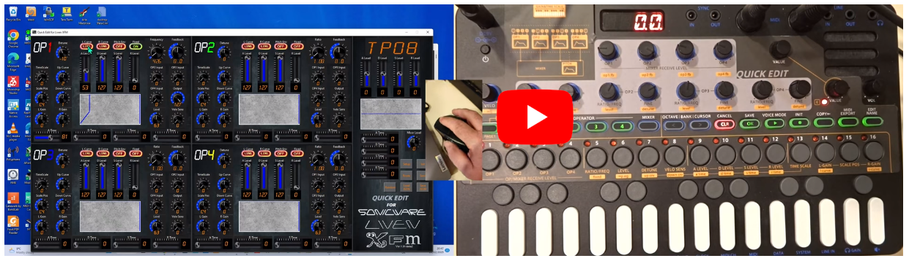

# XFM
## Sysex viewer/editor for Liven XFM

So this is intended to be a patch editor for XFM. As users will know the on-board editing in XFM, with the overlay, is quite a convoluted process because your only view of what is going on is through that four character 14-segment display so you can't "picture" the ADSR wave shapes or anything like that and you can only see the set value of **one** control at a time.

The plan with this Python utility is to be able to see everything at once, as "visually" as possible. The aim is also that the interface to XFM itself be as seemless as possible. It's true that you will have to manually trigger a patch to be sent from XFM to the PC/editor but once in the editor, as changes are made they should be automatically sent back.

BUT STOP RIGHT THERE - so here is the current "problem" with this editor and the reason it's not "released" yet. When XFM sends a patch it sends three sysex messages. One is just a preamble, then there is the main body of the patch in the middle message, then finally the third message is some kind of CRC/hash to validate the data. This is fine if all you were doing is sending patches to a PC to be stored "as is" without changing them. You could then send the three messages back when you wanted to restore that patch. But if, while the patch is on the PC, you EDIT it then when you come to send it back the XFM will say "the payload does not match the CRC". What it actually says is "D.ERR" on the 4 characters. So for an editor to work it needs to recalculate the hash/checksum after changes. I've spoken to Sonicware about this. They couldn't give me the curret re-calculation algo but they have promised that XFM firmware will be updated to make it easier to upload changed patches. Until then this program is really just a *viewer* to see how patches saved out of XFM are constructed.

So on to the development...

### Graphics

The first thing I did was a simple Python program, adsr.py, (I like the simplicity of Tkinter for graphics) to run some experiments in drawing 8 point ADSR envelopes...


This was just playing about to understand how to visually represent 8 parameter envelopes as used by XFM. The work I did here would later become one of the classes used in the main program (with slightly fancier looking graphics)

### MIDI in Python

I also did experiments to read Sysex from XFM (rx_syx.py). I spent some time researching how you could interface to MIDI from inside a Python program. The library I ended up with is "MIDO" but this is really just a high level interface that then relies on a lower level, back end to connect to "ports" and in this case that is RT_MIDI. With mido you can just mido.get_input_names() to find the MIDI ports available and mido.open() one and register callback=function and then that function is called with a message each time something arrives on the port. I wrote some code to then hex/ASCII dump the 230+ bytes of the main patch message


At the start I had no idea what any of the bytes of this data controlled. It's not documented anywhere and Sonicware were too busy working on things like LoFi12 and SmplTrek to take time out to produce a document. So a lot (an awful lot!!) of the work in this project was capturing 100's if not 1000's of Sysex dumps like this picture. Each time I would make some small control adjustment and see what bit/bytes changed. The complexity of the layout of the data is simply incredible. I sort of assumed it would be a C struct and one localized element might change for a control adjustment but for some things the bytes are split all over the place. This is especially true for controls that don't have a simple 7bit (MIDI sized!) value holding 0..127. For things like Frequency/Ratio/Feedback you will not believe how complex the storage of the values is !! But to get a flavour...
```
    if offset == 0:
        freq = ((bytes[offset + 0x4D] * 65536) + (bytes[offset + 0x4C] * 256) + bytes[offset + 0x4B])
        if bytes[offset + 0x49] & 0x20:
            freq = freq + 128
        if bytes[offset + 0x49] & 0x10:
            freq = freq + 32768
    else:
        freq = ((bytes[offset + 0x4D] * 65536) + (bytes[offset + 0x4B] * 256) + bytes[offset + 0x4A])
        if bytes[offset + 0x44] & 0x02:
            freq = freq + 128
        if bytes[offset + 0x44] & 0x01:
            freq = freq + 32768
    print("op1 freq = ", freq)
```

However in discussion with Sonicware I later found out the reason for this and it all stems from the fact that MIDI data is 7bit. So if they have a block of patch variables that contain 8/16/24bit values this cannot be sent "as is" within a Sysex. So the main payload is actually put through an 8 bit to 7 bit conversion where the data is broken into blocks of 7 bytes and each is output preceded by a mask byte (also 7 bits) in which  it indicates which, if any of the subsequent 7 need to have an 8th bit (ie + 128) added. Once I understood this the payload made much more sense and while the original decode had me combining + 128's and + 32768's from all over the place - the new decode was much cleaner and the parameters were grouped in sensible ways.

### Graphics / Animations

I love playing with knobs!

I also wanted to prototype the "look" of the program before I had any way to draw animated knobs in Python. So I reverted to my old friend Ctrlr which is a GUI program for making MIDI control panels. 

[Ctrlr](https://ctrlr.org)

[Ctrlr on Github](https://github.com/RomanKubiak/ctrlr)

I was just interested in laying out controls more than anything. Now with Ctrlr it has a default "look and feel" as seen in this control panel I actually used for my own design Teensy4 based synth:


But I wanted to use my own knob design. Reading around I found that some users of Ctrlr used a dedicated knob design program called Knobman because Ctrlr can have an animation file attached to a control that is then used to draw each step of the control:

[Knobman](https://www.g200kg.com/jp/software/knobman.html)

There's Windows specific versions, Java versions and even an online based editor - I ended up using all 3 because each had specific things only they could do (like my "LCD like" font could only be used in Windows!). As well as the tools there is a gallery of knob designs from other people:

[Knobman Gallery](https://www.g200kg.com/en/webknobman/gallery.php)

It's slow to load but worth the wait as there's tons of knob designs there to choose from (or you can draw from scratch if you want). I ended up with a bit of both. Now I actually like the look of a knob like:


It had a "3D" look but I didn't like the red/white scale or the red pointer. I also noticed when I was editing on the XFM with the editing overlay in place that because the holes for the knobs were a bit bigger then the knobs themselves a "blue halo" would show through so I used knobman to create my own knob design that has subtle "ticks" in white to show scale but then a blue halo that grows as the knob is turned.

Another requirement I had (apart from the blue halo) was a way to instantly read the value of every control. So I searched and searched and found a Truetype LCD font

[LCD_Mono Truetype font - like XFM display](https://www.dafont.com/lcd-lcd-mono.font)

that was very like the characters in the XFM display. So I overlaid this on the rotary controls so they would show the value of the reading. In the end the editing looked like:


Knobman basically takes all the design elements of the knob (some of which vary from frame to frame - like the angle of the white mark, the blue halo and the LCD printed value) and then it creates either animated GIFs or animated PNG files with every frame in it. I already knew about animated GIF but didn't know about animated PNG. In the latter it basically draws each frame either side-by-side or on top of one another in a very wide or very tall image. The nice thing about that is that if you want to do your own animator it's just a case in a file that is w x N*h to cut out the rectangle from (0, h * N1) to (w, h * N2) and drawing that. As many of the controls have a 0..127 range they are effectively 128 small rectangles on top of one another. The code directory is full of such PNG animations like:


(that is just -18 to +18 so 37 steps but many are 128 small pictures!)

So anyway, having created PNG animations it was possible to initially prototype the look of the layout (complete with operational / animated knobs) in Ctrlr so it looked like:


(the one thing I could not fake "inside" controller were my dynamic ADSR curves so in this they are just static images as "placeholders").

Having seen how this would look in Ctrlr I then set about presenting an almost identical look and feel from actual Python code which basically involved writing an animation engine to be able to display one of many (often 128) small images in one location pulled out of an animated PNG file and to then add mouse support so that mouse events would be reported back into the "control" and allow its value to be adjusted. The UI of the program would then involve laying out about 100+ such controls and having code to load values into the controls when a MIDI Sysex patch arrives or to read the values back out if they were to be sent out by MIDI.

As I wanted to be able to save/restore edited patches to disk I actually hold the values of every control in an associated array (dictionary) and once you have it in that it's trivial to save/load to JSON.

### The final Python program

So all the foregoing were just prototyping experiments (it's a good way to approach software design in fact). So I had python code that proved I could draw dynamically changeable ADSR curves. I had code that could do MIDI interactions with XFM. I spent 10's and 10's of hours doing reverse engineering on the patch format (oh and something I bet no one else knows - if you change a patch name to include a "." (1..4 of them) then the patch dump gets 5 bytes longer and the location of about half the things in it change (sadly not everything!). So I actually had to do the reverse engineer of everything TWICE - once for 4 character names and one for 4 character + dot names!). I had designed all the animated graphics and I wrote a Python program using nothing but Tkinter to be able to draw any given animation frame. I then added "mouse awareness" to that so that the animations were "hot" and you could adjust them by dragging the mouse over them.

So finally it came time to put all these experiments together in one big program and I ended up with this...


Having watched one of Chris ("Lody") Dodsworth's excellent Sonicware videos I was inspired by a sketch he drew trying to explain XFM signal routing...


to implement a feature so that when "Route" is pressed on the main editor this secondary window will be toggled on. It shows the signal routing between each operator (density of line indicates strength of signal). Signal shape is shown - when feedback is close to 0 it is "sine", when large positive (but not 63..64) it is sawtooth, when positive 63..64 it is noise, when large negative it is square...


### Running / Using the code

So it's a Python program which means that to be able to run it using a git clone of this repository you need to have Python installed. It does not work with the now dead Python 2.7. It has to be some flavour of 3.x (a later one!)

Because I tried to stick with lib code that comes with Python (like Tkinter for the GUI graphics) there's not much else you need to install to run it. The main thing is going to be the libs for MIDI support. So you probably need:

    pip install mido
    pip install python-rtmidi

The latter is the lower level support (RTmidi) that allows Mido to open and interact with the MIDI ports on the machine.

If it's not installed already you will also need

    pip install pillow

While writing these words I also found that I used a feature in PIL (Pillow - part of Python's image handling) that is only available in a fairly recent Pillow (> v9.x) and that such a late version of PIL is only compatible with later versions of Python (3.9, 3.10, 3.11) so if you have an earlier 3.6 (say) you may need to upgrade and if "pip list" shows your Pillow is an older version before V9 you may need to do a pip upgrade of that wheel too.

To execute the program

    python xfm.py

### Download

While you can "git clone" this repository and "python xfm.py" to run the code (which is what you would do if you plan to work on this and edit the .py code) it is much easier if you simply want to "use" the program to select "Releases" on the right of this screen, pick the latest issued release and download the .zip file for it. The release .zip has been created using package.bat (in this repo) which in turn uses pyinstaller which gathers together a copy of pythong, the code itself, all the support libs it uses and builds them into one .exe file.

Also in the .zip are some added support files:

**settings.json**: I mentioned this in the video, it's a very simple 2 entry file. You can use Notepad or some other simple text editor to set either option "true" or "false". One will add white bounding rectangles to make the position of the controls/labels more obvious. The other will pre-tick the "save JSON" option on the Setup screen which means that each time a patch arrives from XFM it is saved as Patch_<name>.json  

**initpatch.json**: this is simply a copy of the TP01 patch after I told XFM to "init" a patch being edited then extracted this from XFM. This is the first file the editor loads to ensure that all the controls start in the default state. It's also reloaded if you press "Init". If you wanted to set up a "template" so the editor always starts in the same place or returns to it when "Init" is pressed then either edit this file or just copy a JSON patch file you have extracted or worked on over the top of initpatch.json

**images_animations/*.***: this is how the editor works - all the controls are just multi-frame PNG animation files and they are all stored in that images_animations/ sub-directory and are loaded at the very start when you first run the program. The pause as the program starts is because it's taking each of these and breaking each one into 100+ sub-images and storing them in a Python dictionary in memory. When you drag a control from value 37 to 56 or whatever all you are really doing is having it play animation frames 37 to 56. I created all the animations themselves using Knobman. I have half a mind to make a video explaining how the program works and how I wrote/engineered it and that will include details of Knobman (https://www.g200kg.com/jp/software/knobman.html). In theory this would allow anyone feeling "artistic" to create a new "skin" for the editor - giving it your own look and feel

### How to use

Maybe start by taking a look at these two YouTube videos I made. One is a desktop capture (on a particularly big monitor) to try and explain the operation of the editor but just using files loaded/saved on disk (no MIDI connection to XFM):

[](https://youtu.be/i-gdSHQqYMY)

The other tries to show the real-world situation of XFM, MIDI Interface and PC all connected but is a pretty dreadful video that has sound issues and times when the handheld camera isn't pointing at the right thing - one day it will be replaced with something a bit more professional!

[](https://youtu.be/UviOY5Qm6nM)


When you run the editor the main screen with all the controls appears. During the loading process the program does a JSON load of the file called initpatch.json from disk and loads all the values it contains into each and every one of the controls. This even includes setting the four character name at the top right to be "TP01" which is what XFM  uses it if you ask it to "Init" a patch. The basic patch has very little set apart from OP1 output level set to 127 so it consists of nothing but OP1 playing to the output using the default sine wave at a x1.0 ratio.

The editor is basically a whole load of knobs/sliders of which many have  very simple 0..127 setting range. The program is mouse operated so for the majority of the controls if you click on one and drag up/down or left/right it will increase/decrease the value shown. For more accurate control you can also adjust by clicking left/right mouse buttons where left click decreases the control by one step and right click increases it by one. The program also supports mouse wheel operation. So you can rotate mouse wheel up/down to increase/decrease the control.


There are three knobs (only two visible at any time) that behave a little different from all the others. These are the Ratio/Frequency and Feedback knobs at the upper right of each panel. For Frequency mouse drag up/down adjusts the upper 2 digits (hunderds/thousands) and mouse drag left/right adjusts the lower two digits. For Ratio and Feedback up/down adjusts the integer part and left/right adjusts the decimal fractional part.


The controls can be (and are more easily) adjusted my mouse-wheel movements too. The vertical scroll wheel will adjust the upper two digits (Frequency) or non-fractional part (Ratio / Feedback). 


A horizontal scroll wheel (justification for getting something like a Logitech MX Master mouse!) will adjust the lower two digits (Frequency) or the fractional part (Ratio / Feedback).


If using a mouse that only has a single scroll wheel then horizontal scroll wheel can be "simulated" by moving the vertical scroll wheel with Shift held down.